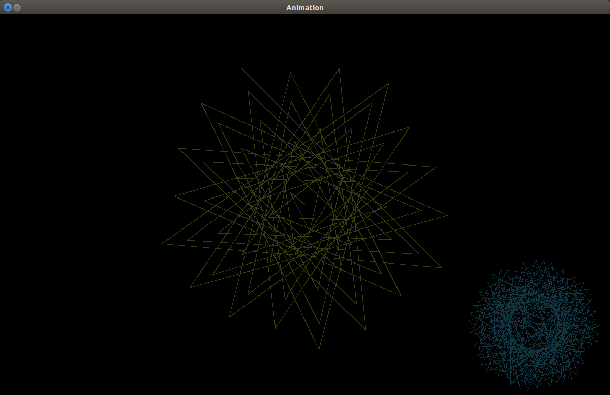

# Fractal-plan

This repository shows some operations with plane geometry (for now) that induces to an animation with music.

#### DANGEER!

Everything you'll see here is a lot of **mad** stuff. Careful to not lose your sanity (if you still have).



## Dependency

You will **need** of:

* [Python3](https://www.python.org/)
* [Pygame](http://www.pygame.org/download.shtml)

To install pygame in linux debian-based you have two options:

* Using **apt**:
  ```bash
  sudo apt-get install python3-pygame
  ```

* Using **pip**:
  ```bash
  sudo pip install pygame
  ```

## Usage

This a beautiful thing. Why you don't only execute this? Fuck the explanation. Just execute!
  
* `python fractal.py`

Optionals:

* `python fractal.py --music-dir <your-music--directory-content>`
* `python fractal.py --no-music`

__These are the fuckin' action keys:__

| Key   |      Action       |
|-------| ------------------|
| ESC   |  Exit             |
|  +    |  Plus vertex      |
|  -    |  Minus vertex     |
|  ←    |  Left?            |
|  ↑    |  Up?              |
|  →    |  Right?!          |
|  ↓    |  Down?            |
| ENTER |  Play/Stop Music  |
|  TAB  |  Next music       |
	
## Contributing

0. Understand this code and your propose (I wouldn't know tell).
1. Fork it!
2. Create your feature branch: `git checkout -b my-delicious-feature`
3. Commit your changes: `git commit -am 'Add some delicious'`
4. Push to the branch: `git push origin my-delicious-feature`
5. Submit a pull request :D (if I believe this is a reasonable _PR_, then I'll merge)

## History

Self-destruction. What are you still doing here? Go away!

## Roadmap 
- [ ] Find answer of the multiverse with hash #42 (weightless).
  - [ ] Implement a representation of fractal geometry with the set of complex numbers.
  - [ ] Encode a genetic algorithm with number theory and numerical analysis. 
  - [ ] Try understand what the main fuckin' developer is doing.
- [X] Pull random musics of the user data.
- [X] Make some interactive graph (I made two).


## Credits
  
* Me (Manoel Vilela)

## License

[Creative Commons ShareALike](LICENSE)